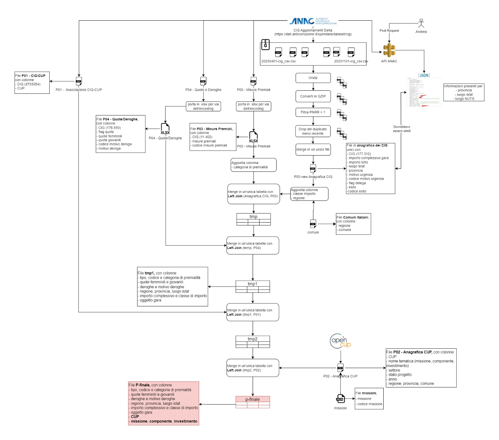

# 🔍 Pulizia e Preparazione dati PNRR 🛠️
Repository creata per manutenere il codice di aggiornamento della base dati per la [app di monitoraggio PNRR](https://public.tableau.com/app/profile/period.thinktank/viz/AnalisiPnrrimpattidigenere/Home) di [Period Think Tank](https://www.thinktankperiod.org/). La nostra associazione crede nei principi di Data Democratization, del monitoraggio civico e dell'open source, motivo per cui rilasciamo il codice in formato open. 

**ATTENZIONE**: il codice presente nella repo non prevede alcun tipo di garanzia nel suo funzionamento; per ogni dubbio rispetto all'implementazione dello stesso scrivere a dyperiod@gmail.com. 


*Draft Pipeline di Estrazione del Dato finale*

## 📝 Risorse Utili 
* [Link](https://docs.google.com/document/d/1HaHIbAhVGqhypHSc_gMIXG6Z4ioIH56mi-BsnI2Ty1w/edit#heading=h.r13rq9c3hkqr) ad analisi funzionale realizzata da @lalafrufru e @alessandrapomella  
* [Link](https://docs.google.com/document/d/15TFWF38qALM83yI11kMPHrwp-16bFSK8/edit) recap di fine tirocinio @alessandrapomella
* [Notebooks](notebooks/data_prep_old) di collezionamento e preparazione del dataset finale prodotti da @alessandrapomella per la [precedente iterazione](https://github.com/PeriodThinkTank/analisi-dati-pnrr) della web app. 


## ？Recap delle fonti dati 
| ID | Descrizione | Formato | Fonte | Ultima Estrazione | Ultimo Aggiornamento | Freq. Aggiornamento | Commenti |  
|:---------|:------|:--------|:------------------|:---------|:---------|:------|:----|
| P01 | **Associazione CIG-CUP** | `.csv`| [ANAC](https://dati.anticorruzione.it/opendata/dataset/cup) | 22/01/2024 | 03/06/2024 | Mensile | NA |
| P02 | **Progetti del PNRR – Universo ReGiS** | `.csv`, `.xlsx`, `.json` | [ItaliaDomani](https://www.italiadomani.gov.it/content/sogei-ng/it/it/catalogo-open-data/Progetti_del_PNRR_Universo_ReGiS.html)| 18/04/2024 | 18/04/2024 (v6) | Trimestrale (?) | NA |
| P03 | **Premialità** | `.csv`, `.xlsx` | [ANAC](https://dati.anticorruzione.it/opendata/dataset/misurepremiali-pnrrpnc) | 27/06/2024 | 27/06/2024 | Mensile | NA |
| P04 | **Quote e Deroghe** | `.csv`, `.xlsx` | [ANAC](https://dati.anticorruzione.it/opendata/dataset/indicatori-pnrrpnc) | 27/06/2024 | 27/06/2024 | Mensile| NA |
| P05 | **Anagrafica CIG** (2023) | `.csv` | [ANAC](https://dati.anticorruzione.it/opendata/dataset/cig) | 08/01/2024 | 18/01/2024 | in attesa di aggiornamento 2024| NA |
| Comuni | **Elenco Comuni Italiani** | `.csv` | Istat | NA | NA | NA | NA |
| Missioni | **Elenco missioni/sottomissioni PNRR** | `.json`| NA | NA | NA | NA | NA |
| Indicatori PNRR | **Mappatura indicatori comuni del PNRR** |  `.csv`, `.xlsx`, `.json` | [ItaliaDomani](https://www.italiadomani.gov.it/content/sogei-ng/it/it/catalogo-open-data/mappatura-indicatori-comuni.html) | NA | 18/04/24 (v6) | NA | Dataset citato nell'articolo di [inGenere](https://www.ingenere.it/articoli/forma-senza-sostanza) |
| Target PNRR | **Indicatori Target del PNRR** | `.csv`, `.xlsx`, `.json` | [ItaliaDomani](https://www.italiadomani.gov.it/content/sogei-ng/it/it/catalogo-open-data/indicatori-target-del-pnrr--dati-validati-.html) | NA | 15/03/2024 | NA | NA |
| Indicatori PNRR & SDGS | **Monitoraggio delle misure del PNRR attraverso gli indicatori di sviluppo sostenibile (SDGs) e dell'Agenda 2030** |  `.csv`, `.xlsx`, `.json` | [ItaliaDomani](https://www.italiadomani.gov.it/content/sogei-ng/it/it/catalogo-open-data/monitoraggio-delle-misure-del-pnrr-attraverso-gli-indicatori-di-.html) | NA | 19/06/2024 (v5) | NA | Dataset di interesse per alcune misure presenti che potrebbero impattare direttamente sul genere e inclusività |
| Indicatori Comuni Universo Regis | **Contiene i Codici Indicatori per associare le misure PNRR** |  `.csv`, `.xlsx`, `.json` | [ItaliaDomani](https://www.italiadomani.gov.it/content/sogei-ng/it/it/catalogo-open-data/indicatori-comuni-europei-del-pnrr---universo-regis.html) | NA | 18/04/2024 (v2) | NA | Dataset di interesse per l'incrocio con misure e submisure |

## 🐍 Installazione Ambiente Python 
Per installare sul proprio ambiente python le librerie necessarie all'utilizzo del codice della repository, è sufficiente aprire il terminale nella cartella in cui è salvata questa repo e lanciare il comando  

````
    pip install -r requirements.txt
````

## 💾 Download dei Dataset 
Una volta installate le librerie necessarie, si ha la possibilità di  effettuare il download automatizzato di vari dataset
* **Master Table**: il dataset su cui abbiamo costruito la nostra dashboard Tableau piò esseere scaricato lanciando il comando `python main.py`, una volta eseguito il quale si dovrebbe ottenere  un file `.csv` in una sottocartella chiamata `.data/`
* **Datasets Intermedi**: per ottenere anche i vari dataset che concorrono alla creazione della master table, utilizzare il [notebook 00](notebooks/01_create_master_table.ipynb)
* Dataset **ItaliaDomani**: questi dati nono sono attualmente integrati nella dashboard Tableau, ma è in programma di integrarli con altre viste; nel frattempo, possono comunque essere scaricati e utilizzati per ulteriori analisi tramite il [notebook 00](notebooks/01_create_master_table.ipynb) 


## 📕 Note Metodologiche 
* I dataset Comuni e Missioni vengono presi come dati e non aggiornati.
* Per il resto delle fonti dati, al fine di popolare la dashboard di frontend con informazioni rilevanti e aggiornate, Period Think Tank effettuerà l'aggiornamento con frequenza adeguata. 

## 🤝 Contribuire e Citare 
Per collaborare e contribuire allo sviluppo della repository è possibile 
* aprire un [issue](https://docs.github.com/en/issues/tracking-your-work-with-issues/creating-an-issue), in caso si pensi che manchi qualcosa che si vorrebbe vedere integrato nella repo;
* contribuire attivamente allo sviluppo creando un proprio branch ed effettuando una [pull request](https://docs.github.com/en/pull-requests/collaborating-with-pull-requests/proposing-changes-to-your-work-with-pull-requests/about-pull-requests) su branch di `dev`. 

> 📘 Citare  
>
> Per ***citare*** il lavoro di democratizzazione di queesti dati svolto da Period Think Tank è sufficiente nominare questa repository tra le fonti del proprio lavoro

